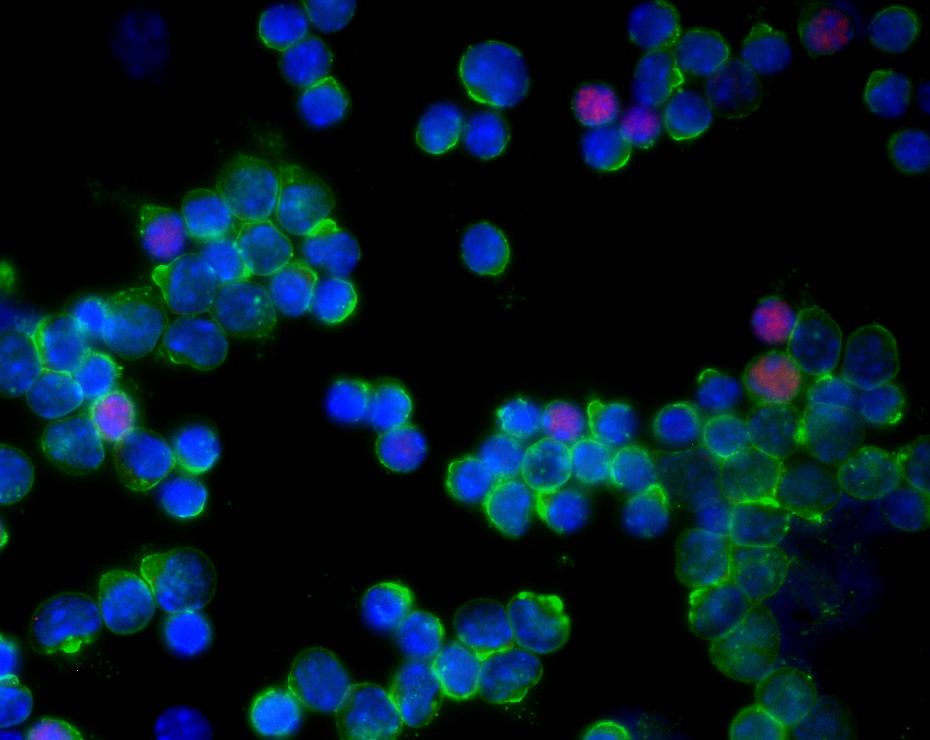

## Welcome to Ono Lab website

Dr Masahiro Ono is the developer of **T**imer-**o**f-**c**ell-**k**inetics-and-Activit**y**, **Tocky**, which uses Fluorescent Timer protein and thereby allows analysis of temporal dynamics os cell activities and development in vivo. This is realised by integrated tools using molecular biology, immunology, and computational analysis.

Ono Lab provides solutions for **single cell data** and **flow cytometric data** 
using **Tocky Analysis** and **Multidimensional analysis**

Dr Masahiro Ono is an immunologist and expert in T-cell regulation. His research focuses on mechanisms of T cell activation and regulation in autoimmunity, infections, and cancer. He is the pioneer of the Timer-of-Cell-Kinetics-and-Activity (Tocky, とき), which analyses temporal changes of T-cell activities in vivo using Fluorescent Timer protein.

Dr Ono did his undergraduate in Faculty of Medicine, Kyoto University (1993-1999, MD) and later was trained in dermatology. He did his PhD in 2002 - 2006 in the study of regulatory T cells (Tregs) and the transcription factors Foxp3 and Runx1, starting his immunology career. In 2009, he obtained a HFSP Fellowship, and joined University College London (UCL), when he extended his research to immunological genomics. In 2012, he was awarded a BBSRC David Phillips Fellowship, and established his lab in UCL. He joined Imperial in 2015 and was appointed as a Senior Lecturer in 2018. He was promoted to a Reader in Immunology in 2020.

[Professional homepage](https://www.imperial.ac.uk/people/m.ono)

[Twitter (MonoTockyLab)](https://twitter.com/MonoTockyLab)

Under construction
